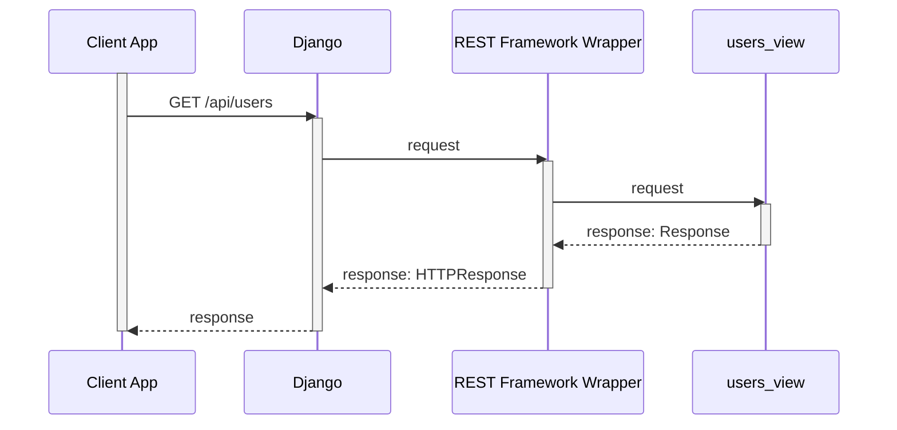

# Django Authentication

## REST Framework Authentication

Here I am going to put a brief overview on the Django REST Framework Authentication flow. For full details, refer to the [REST Framework Documentation](https://www.django-rest-framework.org/api-guide/authentication/).



_Sequence diagram for a typical Django REST Framework request._

1. Client application sends a request to Django to get the `users` resource. 
2. Django dispatches the request to the REST Framework Wrapper, associated with the resource. Each REST Framework view is wrapped by a REST Framework Wrapper. You might think that the view is called directly, but in fact it's wrapper is beling called first and the wrapper calls the actual view. Before calling the view the view wrapper does some perapration, including authentication and authorization handling.
3. The REST Framework Wrapper calls the actual view function.

Before calling the actual view, the REST Framework Wrapper will execute all associated authentication schemes and will apply all associated permissions. If everitying is OK, than the REST Framework Wrapper will execute the view. 

### Custom Authentication Scheme

Authentication scheme for Django REST Framework authentication extends from `BaseAuthentication` class, implementing two methods: `authenticate` and `authenticate_header`.

Here is an example:

```python
from rest_framework.authentication import BaseAuthentication
from rest_framework.exceptions import AuthenticationFailed
from django.conf import settings
import jwt

class JWTAuthentication(BaseAuthentication):
    def authenticate(self, request):
        auth_header = request.headers.get('Authorization')

        if not auth_header:
            return None

        try:
            auth_token = auth_header.split(' ')[1]
            decoded_token = jwt.decode(auth_token, settings.SECRET_KEY, algorithms=['HS256'])
            user_id = decoded_token.get('user_id')
            user = User.objects.get(pk=user_id)
            return (user, None)
        except (jwt.exceptions.DecodeError, User.DoesNotExist):
            raise AuthenticationFailed('Invalid token')
```

If `authenticate` method returns `None` this signals to REST Framework to attempt authentication with next registered authentication scheme. In our example, if `Authorization` scheme is not provided, the `authenticate` method ignores the authentication request by returning `None`.

In case the authentication fails, e.g. invalid username/password combination, `authenticate` method should raise `AuthenticationFailed` exception. This would signal to REST Framework to stop the authentication and return authorization error to the client applicaiton.

In case of successfull authentication, `authenticate` method returns a tuple. The first element of the tuple is a User model instance of the authenticated user. The second element of the tuple is `auth` which is typically used in more complex authentication flows.

Custom authentication scheme could also implement the `authenticate_header` method. Thiss method returns a string to be used as the value of the `WWW-Authenticate`
header in a `401 Unauthenticated` response, or `None` (default implementation) if the authentication scheme should return `403 Permission Denied` responses.


To reister our custom authenticatio scheme with all views, add it to the `DEFAULT_AUTHENTICATION_CLASSES` in Django's `settings.py`.

```python
REST_FRAMEWORK = {
    'DEFAULT_AUTHENTICATION_CLASSES': [
        'path.to.JWTAuthentication',
        # ...
    ],
    # ...
}
```

Alternatively, you could specify per-vew authentication classes. Refer to the documentation for more details.


